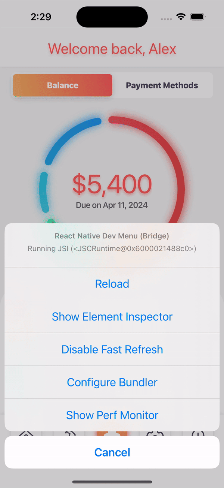

# React Native Donut Chart
A React Native library for creating responsive donut charts that animate when data changes



## Installation

```bash
npm i -S @figliolia/rn-donut-chart react-native-svg
# or
yarn add @figliolia/rn-donut-chart react-native-svg 
```

## Usage 
```tsx
<DonutChart
  delay={0}
  duration={1500}
  strokeWidth={12}
  strokeLinecap="round"
  style={Styles.yourContrainerStyles}
  data={[{ 
    label: "rent", 
    value: 2000, 
    stroke: "rgb(228, 69, 69)", 
    style: Styles.yourSVGStyles // such as shadow and stuff
  }]}
  easing={Easing.out(Easing.exp)}
  onMeasure={(dimensions: number) => {}}>
  {children}
</DonutChart>
```

  

### Options

`delay?`: A millisecond duration to delay the animation. Defaults to `0`

`duration?`: A milliscond duration for the animation. Defaults to `1500`

`easing?`: An easing function for your animation. Defaults to `cubic-bezier(0.16, 1, 0.3, 1)` or React Native's `Easing.out(Easing.exp)`

`data`: Data to supply the chart's sections

`strokeWidth?`: The width of the donut arcs. Defaults to `25`

`strokeLinecap?`: A line cap style - `round`, `square`, or `butt`. Defaults to `round`

`style?`: Styles for the View containing your graph

`onMeasure?`: A callback invoked with the resolved dimensions of your graph, useful if using responsive sizes

`children`?: React Node's for adding UI elements to your graph
